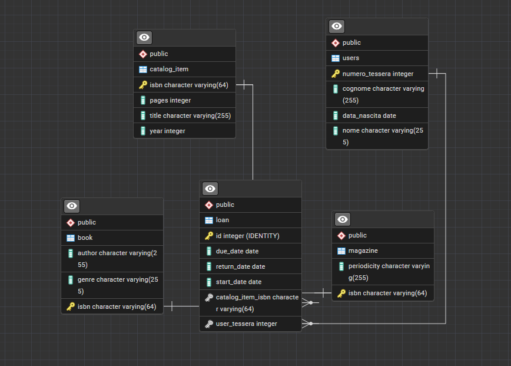

## 📦 Progetto

il progetto utilizza Java, JPA e Scanner

Entities:
CatalogItem è una superclasse di tutti gli elementi del catalogo
Book estende CatalogItem con autore e genere
Magazine estende CatalogItem con periodicità
User rappresenta un utente della biblioteca
Loan rappresenta un prestito di un CatalogItem a uno User

Dao:
CatalogDAO gesisce gli elementi del catalogo

Application:
Gestisce l'interfaccia utente

Diagramma ER:
Il sistema utilizza una struttura gerarchica per gestire diversi tipi di articoli:

catalog_item:
Questa tabella funge da entità genitore, contenente gli attributi comuni a tutti gli elementi che possono essere
prestati

book:
Tabella che rappresenta i libri, ereditando tutti gli attributi da catalog_item

magazine:
abella che rappresenta le riviste, ereditando tutti gli attributi da catalog_item

users:
Questa tabella registra le informazioni anagrafiche degli utenti della biblioteca autorizzati a prendere in prestito
articoli

loan:
Questa è la tabella centrale che gestisce l'associazione tra un utente e un articolo, registrando tutti i dettagli di un
singolo prestito

Relazioni Prestiti:
loan a catalog_item (N:1)
loan a users (N:1)

Relazioni Ereditarietà:
book ⟷ catalog_item (1:1)
magazine ⟷ catalog_item (1:1):

---

## 📺 Preview

